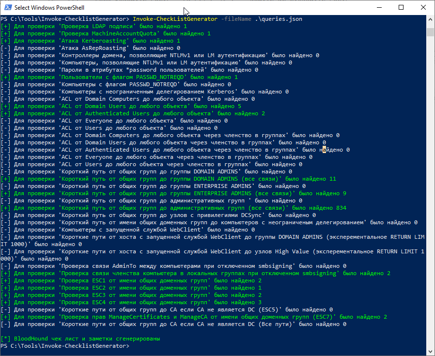

Скрипт Invoke-CheckListGenerator преобразует результаты Cypher-запросов BloodHound в структурированные чек-листы Obsidian, позволяя автоматизировать процесс аудита безопасности Active Directory и отслеживать прогресс исправления уязвимостей.

Есть два JSON файла `queries.json` и `ownedqueries.json`, которые содержат Cypher запросы, описание и мета данные для формирования результата. В первом файле находятся общие проверки, а во втором почти то же самое, но пути строятся от скомпрометированных учетных записей (`n.owned=TRUE`).

## Ключевые возможности:
- Автоматическое обнаружение уязвимостей AD через Cypher-запросы
- Структурированные чек-листы с поддержкой Dataview
- Интеграция с Obsidian для управления задачами безопасности
- Гибкая настройка проверок безопасности


## Базовое использование
```powershell
# Запуск всех проверок безопасности
Invoke-CheckListGenerator -dbPassword Qwerty123

# Запуск для проверок от имени скомпрометированных записей
Invoke-CheckListGenerator -dbPassword Qwerty123 -fileName ownedqueries.json
```



## Ограничения

### Технические ограничения
- **Требуется локальный доступ** к Neo4j instance
- **Поддерживает только Active Directory** данные BloodHound
- **Однопоточное выполнение** запросов (может замедлять большие графы)
- **Нет инкрементального обновления** - каждый запуск перезаписывает файл

### Функциональные ограничения  
- **Только статические запросы** - нет динамического анализа путей
- **Базовая обработка ошибок** - сбои подключения могут прервать выполнение
- **Ограниченная кастомизация** выходного формата

## Добавление пользовательских проверок
```json
{
  "name": "Название проверки или задачи",
  "description": "Описание проверки или задачи",
  "type": "Nodes или Path",
  "selfcheck": true или false,
  "query": "Cypher запрос"
},
```

**Примечение**
- Скрипт принимает два значения атрибута type первый это Nodes для узлов и Path для путей. Этот параметр используется для вывода информации. 
- Если проверка является самостоятельной `SelfCheck = True` и у нее есть результат она помечается как выполненная со статусом успех.


### Дополнение к выводу запросов

Для вывода узлов (type = Nodes)
```
MATCH ... RETURN var.name
```

Для вывода путей (type = Path)

```
MATCH ... RETURN REDUCE(s=nodes(p)[0].name, i IN RANGE(0, SIZE(relationships(p))-1) | s + '-' + type(relationships(p)[i]) + '->' + nodes(p)[i+1].name) AS pathDescription ORDER BY length(p) LIMIT 1000"
```

### Ссылки

- [Obsidian: за гранью заметок. Заметки](https://t.me/cyb3r53cr3t5/230)
- [Obsidian: за гранью заметок. Чек-лист](https://t.me/cyb3r53cr3t5/231)

---

> **Примечание**: Этот инструмент предназначен для легитимного аудита безопасности. Убедитесь, что у вас есть соответствующие разрешения перед сканированием любых систем.

